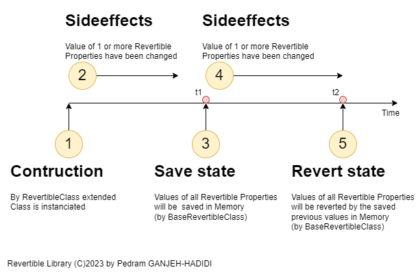

# Revertible
Facilitates defining classes with **Revertible Properties**.

- [Revertible](#revertible)
  - [Features](#features)
  - [Use Case](#use-case)
  - [How It Works](#how-it-works)
    - [State Diagram / Timeline](#state-diagram--timeline)
  - [UML Class Diagram](#uml-class-diagram)
  - [Example Code](#example-code)

## Features
- **[Revertible]** Attribute: Marks properties in a class as revertible.
- **SaveRevertibleProperties()**: Saves the current values of revertible properties.
- **RevertRevertibleProperties()**: Reverts revertible properties to their saved values (if any).
- **HasModifiedRevertibleProperties** (Boolean): Indicates if any revertible property's value has been changed.

## Use Case
Ideal for scenarios where you need to simply revert all changed values, like user-modified settings, without saving the changes to the model or file.

## How It Works
### State Diagram / Timeline
After instantiating a type that extends **BaseRevertible** and includes properties annotated with **[Revertible]**, you can save the current state of the revertible properties to revert them later if needed.

As shown in the diagram below, at state 5, when the revert method is invoked, the values are reverted/set back to the previously saved values at state 3 (t2 == t1).

**Note:** Properties without the **[Revertible]** annotation are always ignored.



## UML Class Diagram
To make your class revertible, simply extend **BaseRevertible** and annotate the properties you want to be revertible with the **[Revertible]** attribute:


## Example Code
Here's a simple example of making a class revertible:
```cs
using Revertible;

// Assigning [Revertible] to the class is optional,
// unless you need to access IRevertible methods outside the class.
[Revertible]
public class RevertibleClass : BaseRevertible
{
    // Just assign [Revertible] to the properties you want to save and revert.
    [Revertible]
    public bool Enabled { get; set; }

    [Revertible]
    public int ID { get; set; }

    [Revertible]
    public string Name { get; set; }

    [Revertible]
    public object SomeObject { get; set; }

    // Properties without [Revertible] are ignored
    public double NonRevertibleDoubleProperty { get; set; }
    public char NonRevertibleCharProperty { get; set; }
}

/*** Save and Revert values ***/
// 
private RevertibleClass _revertibleField = new RevertibleClass();

private void SomeMethod()
{
    _revertibleField.Enabled = true;
    _revertibleField.Name = "John Doe";

    // Save current state of revertible properties:
    _revertibleField.SaveRevertibleProperties();

    // Some other code...
    _revertibleField.Enabled = false;
    _revertibleField.Name = "Something else!";

    // Revert values of revertible properties:
    _revertibleField.RevertRevertibleProperties();
    // Now: Enabled == true and Name == "John Doe".
}
```

