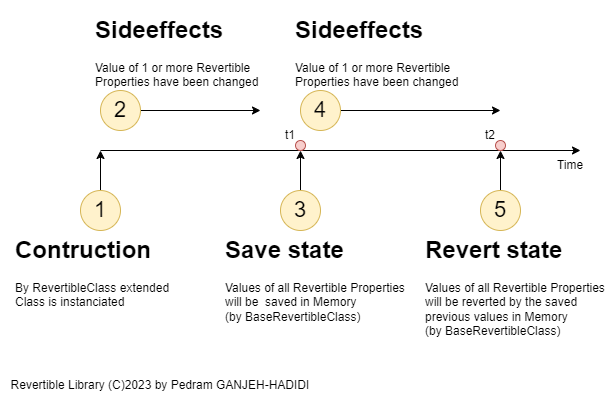
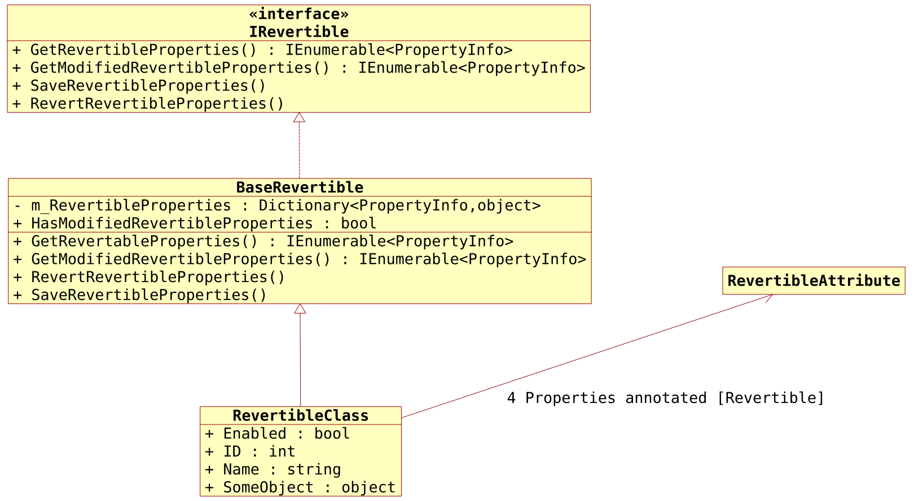

***WICHTIGER HINWEIS: KI-generierter Inhalt – Diese Dokumentation wurde mithilfe von ChatGPT-4 aus dem Englischen übersetzt.***

# Revertible
Ermöglicht das Definieren von Klassen mit **rücksetzbaren Eigenschaften (Revertible Properties)**.

- [Revertible](#revertible)
  - [Funktionen](#funktionen)
  - [Anwendungsfall](#anwendungsfall)
  - [Funktionsweise](#funktionsweise)
    - [Zustandsdiagramm / Zeitstrahl](#zustandsdiagramm--zeitstrahl)
  - [UML-Klassendiagramm](#uml-klassendiagramm)
  - [Beispielcode](#beispielcode)

## Funktionen
- **[Revertible]** Attribut: Markiert Eigenschaften in einer Klasse als rücksetzbar.
- **SaveRevertibleProperties()**: Speichert aktuelle Werte der rücksetzbaren Eigenschaften.
- **RevertRevertibleProperties()**: Setzt rücksetzbare Eigenschaften auf gespeicherte Werte zurück (falls vorhanden).
- **HasModifiedRevertibleProperties** (Boolean): Gibt an, ob der Wert einer rücksetzbaren Eigenschaft geändert wurde.

## Anwendungsfall
Nützlich, wenn Sie geänderte Werte, wie Benutzereinstellungen, einfach zurücksetzen möchten, ohne Änderungen zu speichern.

## Funktionsweise
### Zustandsdiagramm / Zeitstrahl
Nach der Instanziierung eines Typs, der von **BaseRevertible** erbt und Eigenschaften mit dem **[Revertible]** Attribut hat, können Sie den aktuellen Zustand der rücksetzbaren Eigenschaften speichern und bei Bedarf zurücksetzen.

Im Diagramm unten: Bei Zustand 5, wenn die Revert-Methode aufgerufen wird, werden die Werte auf die bei Zustand 3 (t2 == t1) gespeicherten Werte zurückgesetzt.

**Hinweis:** Eigenschaften ohne **[Revertible]**-Attribut werden ignoriert.



## UML-Klassendiagramm
Um eine Klasse rücksetzbar zu machen, erben Sie von **BaseRevertible** und markieren Sie gewünschte Eigenschaften mit dem **[Revertible]**-Attribut:



## Beispielcode
So erstellen Sie eine rücksetzbare Klasse:
```cs
using Revertible;

[Revertible]
public class RevertibleClass : BaseRevertible
{
    [Revertible]
    public bool Enabled { get; set; }

    [Revertible]
    public int ID { get; set; }

    [Revertible]
    public string Name { get; set; }

    [Revertible]
    public object SomeObject { get; set; }

    public double NotRevertibleDouble { get; set; }
    public char NotRevertibleChar { get; set; }
}

private RevertibleClass _revertibleField = new RevertibleClass();

private void SomeMethod()
{
    _revertibleField.Enabled = true;
    _revertibleField.Name = "John Doe";
    _revertibleField.SaveRevertibleProperties();

    // Änderungen vornehmen...
    _revertibleField.Enabled = false;
    _revertibleField.Name = "Something else!";

    // Werte zurücksetzen:
    _revertibleField.RevertRevertibleProperties();
    // Jetzt: Enabled == true und Name == "John Doe".
}
```

