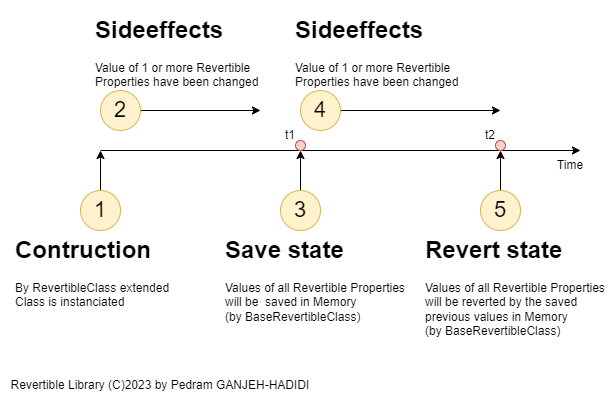

# Revertible
**Geri Alınabilir Özellikler** tanımlamayı kolaylaştırır.

- [Revertible](#revertible)
  - [Özellikler](#özellikler)
  - [Kullanım Senaryosu](#kullanım-senaryosu)
  - [Nasıl Çalışır](#nasıl-çalışır)
    - [Durum Diyagramı / Zaman Çizelgesi](#durum-diyagramı--zaman-çizelgesi)
  - [UML Sınıf Diyagramı](#uml-sınıf-diyagramı)
  - [Örnek Kod](#örnek-kod)

## Özellikler
- **[Revertible]** Attribütü: Bir sınıftaki özellikleri geri alınabilir olarak işaretler.
- **SaveRevertibleProperties()**: Geri alınabilir özelliklerin mevcut değerlerini kaydeder.
- **RevertRevertibleProperties()**: Geri alınabilir özellikleri kaydedilen değerlerine geri döndürür (varsa).
- **HasModifiedRevertibleProperties** (Boolean): Herhangi bir geri alınabilir özelliğin değeri değiştirildiyse belirtir.

## Kullanım Senaryosu
Değiştirilmiş tüm değerleri sadece geri almanız gereken senaryolar için idealdir, örneğin kullanıcı tarafından değiştirilen ayarlar gibi, değişiklikleri model veya dosyaya kaydetmeden.

## Nasıl Çalışır
### Durum Diyagramı / Zaman Çizelgesi
**BaseRevertible**'ı genişleten bir türü anlatıldıktan sonra ve **[Revertible]** ile işaretlenmiş özellikler içeren bir türü anladıktan sonra, gerektiğinde geri dönmek için geri alınabilir özelliklerin mevcut durumunu kaydedebilirsiniz.

Aşağıdaki diyagramda gösterildiği gibi, durum 5'te geri alma yöntemi çağrıldığında, değerler durum 3'te önceki kaydedilen değerlere (t2 == t1) geri döndürülür.

**Not:** **[Revertible]** işareti olmayan özellikler her zaman göz ardı edilir.



## UML Sınıf Diyagramı
Sınıfınızı geri alınabilir hale getirmek için sadece **BaseRevertible**'ı genişletin ve geri alınabilir olmasını istediğiniz özellikleri **[Revertible]** attribütü ile işaretleyin:


## Örnek Kod
İşte bir sınıfın geri alınabilir hale getirilmesiyle ilgili basit bir örnek:
```cs
using Revertible;

// Sınıfa [Revertible] atamak isteğe bağlıdır,
// sınıf dışında IRevertible yöntemlerine erişmeniz gerekiyorsa.
[Revertible]
public class RevertibleClass : BaseRevertible
{
    // Sadece kaydetmek ve geri almak istediğiniz özelliklere [Revertible] attribütü atayın.
    [Revertible]
    public bool Enabled { get; set; }

    [Revertible]
    public int ID { get; set; }

    [Revertible]
    public string Name { get; set; }

    [Revertible]
    public object SomeObject { get; set; }

    // [Revertible] işareti olmayan özellikler göz ardı edilir
    public double NonRevertibleDoubleProperty { get; set; }
    public char NonRevertibleCharProperty { get; set; }
}

/*** Değerleri Kaydet ve Geri Al ***/
// 
private RevertibleClass _revertibleField = new RevertibleClass();

private void SomeMethod()
{
    _revertibleField.Enabled = true;
    _revertibleField.Name = "John Doe";

    // Geri alınabilir özelliklerin mevcut durumunu kaydet:
    _revertibleField.SaveRevertibleProperties();

    // Başka bir kod...
    _revertibleField.Enabled = false;
    _revertibleField.Name = "Something else!";

    // Geri alınabilir özelliklerin değerlerini geri al:
    _revertibleField.RevertRevertibleProperties();
    // Şimdi: Enabled == true ve Name == "John Doe".
}
```